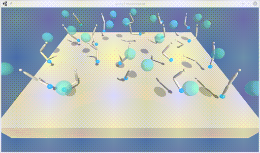

# Project 2 (Deep Reinforcement Learning - Robotic Arm)
---
[Andreas Windisch, Feb. 2019](https://www.linkedin.com/in/andreas-windisch-physics/)

This notebook contains the documentation for Project 2 of the [Deep Reinforcement Learning Nanodegree](https://www.udacity.com/course/deep-reinforcement-learning-nanodegree--nd893). Feel free to play with this code as you please. Also, in case you have any questions or comments, or simply want to contact me, use the link to my LinkedIn profile above, or write me directly using [andreas.windisch@yahoo.com](andreas.windisch@yahoo.com). Have fun exploring this nice project! :-)

### 0. Synopsis

In this project, we will train Agents that control double-jointed robotic arms to follow a certain target-locations that are provided to the Agents. The goal each Agent pursues is to stay within that target location, which could be moving or stationary. 

#### Action Space
Each action is a vector of four numbers between -1 and +1, corresponding to the torque that is to be applied to each of the two joints.

#### Observation Space
The observation space consists of 33 variables corresponding to position, rotation, velocity and angular velocities of the arm. 

#### Rewards
For each time step that a particular Agent places its robotic arm in the target area, a reward of +0.1 is provided. 

#### Goal
The training of the Agents is over, once an average reward of +30 over 100 consecutive episodes is obtained, where the reward for each episode is averaged over all Agents.

#### The untrained Agents
Here is an animation of the untrained Agents who dont have a clue as of what to do in this world. The actions are chosen uniformly random, hence the random-walk like behavior.   

#### The trained Agents
After successful training, the Agents' actions are not erratic and random anymore. The Agents try to place their arms in the target areas, as shown in the animation.   

### 1. Files in this repository

* README.md - This file
* Report.md - A report containg the details of the implementation 
* Continuous_Control_Multiple_Agents.ipynb - A Jupyter Notebook containing the main code for training the Agents 
* model_multiple_agents.py - The Neural Network used for training the Actor and the Critic (PyTorch)
* ddpg_multiple_agents.py - Definitions for the Agent and its actions
* checkpoint_actor_multiple_agents.pth  - The saved status of the actor network
* checkpoint_critic_multiple_agents.pth - The saved status of the critic network
* score_multiple_agents.png - A plot of the score over the training episodes
* multiple_agents_untrained.gif - Animation of the untrained Agent
* multiple_agents_trained.gif - Animation of the trained Agent

### 2. Running the code
The code is this repository requires numpy, PyTorch, Unity ML Agents and Jupyter. Make sure that those are installed. Then, just clone the repository and open the Notebook 'Continuous_Crontrol_Multiple_Agents.ipynb'. Follow the instructions within the notebook to train the Agents.
