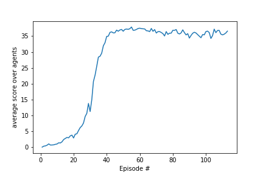

# Project 2 (Deep Reinforcement Learning - Robotic Arm)
---
[Andreas Windisch, Feb. 2019](https://www.linkedin.com/in/andreas-windisch-physics/)

This notebook contains the documentation for Project 2 of the [Deep Reinforcement Learning Nanodegree](https://www.udacity.com/course/deep-reinforcement-learning-nanodegree--nd893). Feel free to play with this code as you please. Also, in case you have any questions or comments, or simply want to contact me, use the link to my LinkedIn profile above, or write me directly using [andreas.windisch@yahoo.com](andreas.windisch@yahoo.com). Have fun exploring this nice project! :-)

### 0. Learning Algorithm

In this project, I utilized the Deep Deterministic Policy Gradient (DDPG) approach to train the Agent using discounting, neural networks for the Actor and the Critic, a common replay buffer shared by all Agents and gradient clipping for the training of the critic. The core implementation has already been used as an example in class. With implementing only small changes to the previous code, the algorithm trained the Agents successfully. In the following, let me discuss the ingredients in more detail.

#### Neural Networks
   
The networks for the Actor and the Critic use 200 and 100 units in their first and second hidden layers respectively. As activation function, I used the Rectified Linear Unit (ReLU) function. The networks are trained through feed-forward and back-propagation. The output layer of the Actor uses a hyperbolic tangent to ensure that the results are mapped to the range [-1,+1].   
   

#### Discounting
With discounting, we weigh the rewards in future less than the ones in the nearere future. The discounting factor gamma has been chosen to be 0.99 in this case.

#### Replay Buffer
Another issue that can arise in Deep Q Networks is, that we want to make use of very rare events, and also exploit the training Agent's experience as much as we can. One such approach is to maintain a replay buffer, from which we sample experience tuples at random. The buffer is shared by all 20 Agents. Here we used a buffer size of 10^5. The batch size is 100. The networks are updated after every step.

#### Summary of hyper-parameters

- replay buffer size: 1e5
- batch size: 100
- gamma (discounting): 0.99
- tau (interpolation parameter soft update): 0.001
- lr_actor (learning rate actor): 1e-3
- lr_critic (learning rate critic): 1e-4
- update rate: 1

### 1. Plot of Rewards
Here is a plot that shows the rewards over the episodes, as the agents are trained. We can clearly see, that the average score approaches the desired number of +30 as the number of episodes increases. In this case, it took 13 episodes to train the Agenta (13 because the last 100 episodes have been subtracted, since the criterion is to maintain an average score of 30 over the last 100 episodes).

### 2. Ideas for Future Work
The chosen algorithm and hyperparameters for this problem worked really well for this environment and for the given training task. There are several possible improvements for future studies. As discussed in class, one could implement the Trust Region Policy Optimization (TRPO) and Truncated Natural Policy Gradient (TNPG) approaches. Alternatively one could also try the Distributed Distributional Deterministic Policy Gradients. 
